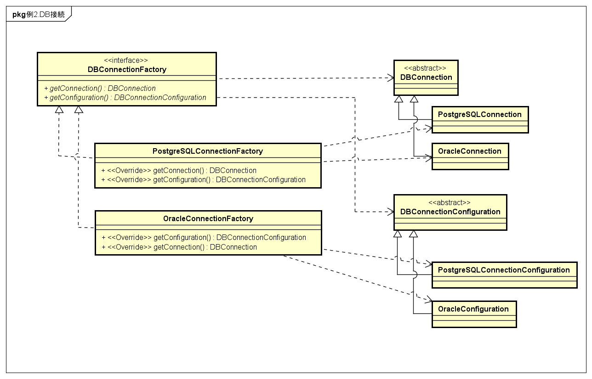

[一覧へ戻る](../README)

# AbstractFactory
* 関連するインスタンス群をまとめて生成する

### 使い所
* 複数の関連クラスがある
  * e.g.
    * (商品, 消費税率) : (食品, 軽減税率8%), (酒, 通常税率10%), (ノンアルコールビール, 軽減税率8%)
* インスタンスを作る際にクラス組み合わせをミスしそうだが、ミスらないようにしたい

### 作り方
1. 複数の関連するクラスを識別
  * 食品, 酒, ノンアルコールビール
  * 軽減税率8%, 通常税率10%
2. 生成する各クラスを親子クラスにする。親を抽象クラス、子は継承した実クラス。
  * 商品: 食品, 酒, ノンアルコールビール
  * 消費税率: 軽減税率8%, 通常税率10%
3. 生成クラスであるFactoryを作る。親はインタフェース、子は実装クラス。
  * Factory: 食品Factory, 酒Factory, ノンアルコールビールFactory 

### 抽象モデル

## 例
### DB接続の設定ファイルとコネクション

### 商品と消費税

