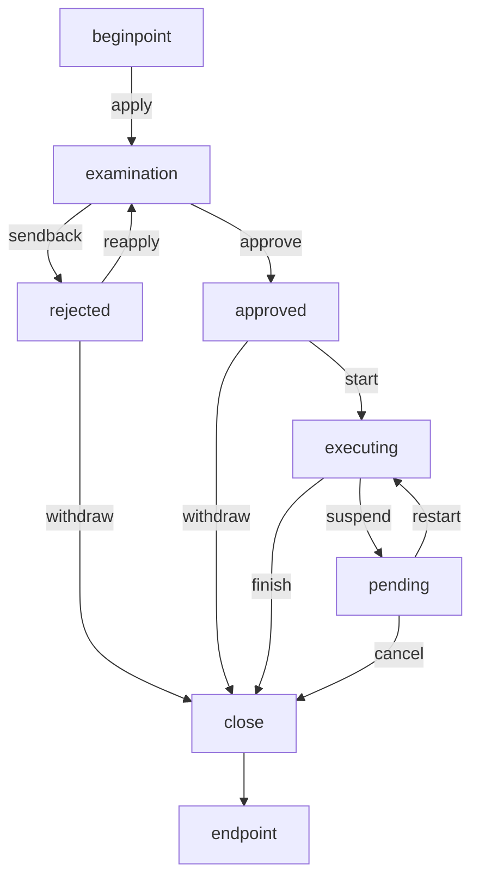

# README

## 場合分け

## 状態遷移

```mermaid
flowchart TD
    beginpoint --apply--> examination
    
    examination --approve--> approved
    examination --sendback--> rejected
    
    rejected --reapply--> examination
    rejected --withdraw--> close
    
    approved --start--> executing
    approved --withdraw --> close
    
    executing --suspend--> pending
    executing --finish--> close
    
    pending --cancel--> close
    pending --restart--> executing
    
    close --> endpoint
```